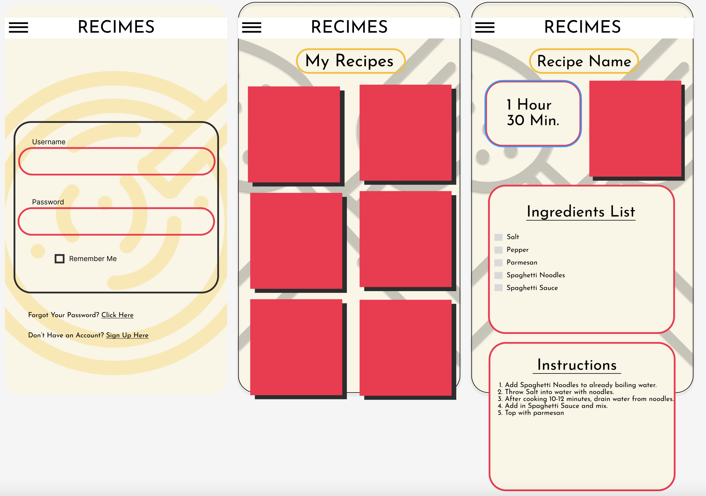

# recime-front

### Reason for building a Recipe app: 
I knew I wanted to build a React app after struggling in the React section of this course.  I felt like I didn't understand very much of it but if I was forced to build an application with it - i'd learn a lot.  I definitely think I've done that.  It's also part of the reason this application is a little bit simple.  

This should be viewed more as a minimum Viable Product here right now.  There are a ton of features I wanted to add but didn't have a chance to.  Working alone definitely slowed things down.  Mainly due to things like running into bugs.  Just having one set of eyes looking at something had to slow me down when I ran into problems. 

My wife always wants a recipe app because we store screenshots of all of our recipes on our phones.  This is actually a complaint you'll hear really often in our house.  So my hope was that this recipe app would be able to have a place to upload your image of a recipe and it's stored right inside the view with the name and any other information you feel like adding.  Unfortunately I just ran out of time to add that feature so it's simply stopped as a place to store information about recipes with a lot of future innovation hopefully coming. 

### Deployed front end:
[Frontend Deployed](https://collinblank.github.io/recime-front/)

### Link to backend repo and deployed backend:
[Backend Repo](https://github.com/collinblank/recime-back)
[Backend Deployed](https://recime-backend.herokuapp.com/)

#### Dependencies Used
 "@emotion/react": "^11.10.4",
  "@emotion/styled": "^11.10.4",
  "@mui/material": "^5.10.8",
  "axios": "^1.1.2",
  "bootstrap": "^5.2.2",
  "react": "^18.2.0",
  "react-icons": "^4.4.0",
  "react-router-dom": "^6.4.2",
  "react-scripts": "^5.0.1",
  "styled-components": "^5.3.6"

  ##### Styled Components
  "Utilising tagged template literals (a recent addition to JavaScript) and the power of CSS, styled-components allows you to write actual CSS code to style your components."  Allowed me to have styled components and made building the burger menu easier.  Included my ternary operator within my styled component to control the button and it's movement of the burger menu. [Styled-Components](https://styled-components.com/docs/basics)
    * included in style components I used Theme Provider.  It's a wrapper that uses the Context API and made the theme variables available to the whole component tree.  We don't have a need to use props so if you look at a file like global.js you'll see "${({ theme })" instead of "props.theme".  The theme is available because I'm using theme provider. Variables are set in the theme.js file.  [Theming](https://styled-components.com/docs/advanced)
  
  ##### Material UI:
  Material UI allowed me to do some really cool styling and apply it to all of my recipes.  Turning each one into cards and creating a grid out of them.  It also included the ability to make the whole card a button really easily. 

  ### Coolest Feature:
  The burger menu I liked a lot.  I added an onClick handler to the component and it calls the setOpen function and toggles the open prop.  I passed the open prop to my menu option as well and used the Menu.styled.js to send the open prop and cause a transformation. Also used open prop to change the burger menu icon color in burger.js and change the divs view. Making the burger go from open to close. 

  The coolest part is closing the menu by clicking outside of it. Had to do some research on this but I Set up a useonclickoutside function that uses useEffect and a ref that checks the clicked element.  I pass node and the function closing the menu as a second argument.  And then I pass node on the div taht wraps my burger and menu so that it understands those two items, when clicked, the menu remains open.  When anything else is clicked the menu closes. 

# Planning Stages: 

## Elements Shared from Screen to Screen in Recime:
* Recimes Header - thin header stretching across.  Always visible (for now). With hamburger menu on far left. 
* Recimes Background Color always #FAF5E6 across all screens. 
* Recimes background image transitioning from simple cooking utensils, boiling pot, etc. (no more than four I think). 

### Elements for Log in Page:
* One simple box housing two separate elements.
    * Username
    * Password

* Underneath box listing Don't Have an Account? Sign up here -> (This goes to sign in page.)

### Elements on Main Page: 
* "My Recipes" listed at the top.  ADD LATER POSSIBLY button ability to take you back to top.
* Two Across - Recipes with images as overlay. Use generic images to start. Names in white text at bottom of box.

### Elements on Recipe Page:
* Recipe Name at top. Same styling as "My Recipes"
* Time in left side. Image in Right side (image generic to start).
* Ingredient List Box below. 
* Instructions Box Below

### Form for username and login.
* Same background and header.
* Enter username.
* Enter password.
* Keep it simple to start.

### Form for adding a new recipe. 
* Enter Recipe Name.
* Enter Ingredients list.
* Enter Instructions. 
* Enter cook time. 
* Keep it simple to start.

###### Our Color Schemes:

FD1F4A - red/pink
FBBD0D - Gold
000000 - black
images on 25% opacity
FAF5E6 - background

###### Variables:
  name: "",
  ingredientList: "",
  cookTime: 0,
  instructions: ""

# Recime in the Future:
#### Future Adds:
    * Ability to have image of done dish.
    * Ability to include image of full recipe.
    * List all ingredients in a nicer order.
    * List instructions in a nicer order. 
    * Fix CookTime box. 
    * Updates to database. 
    * Add categories page.
    * Add recipe publisher to recipe database so that users view is specific to themselves.
    * Ability to log out.
    * Can't decide if a back button would be good.  Home link is always two clicks away. 