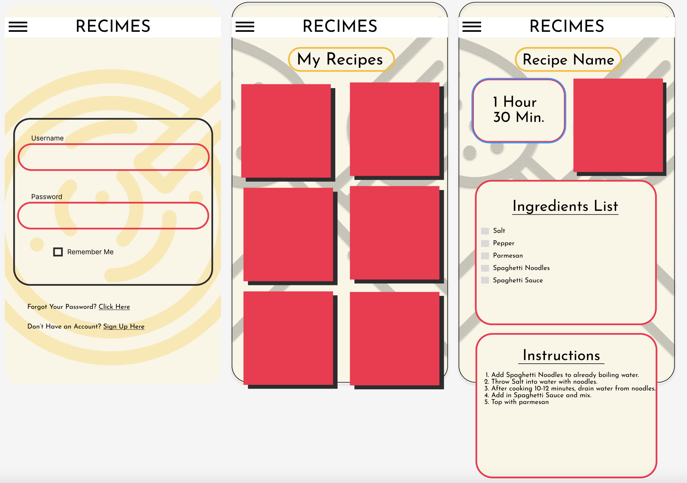
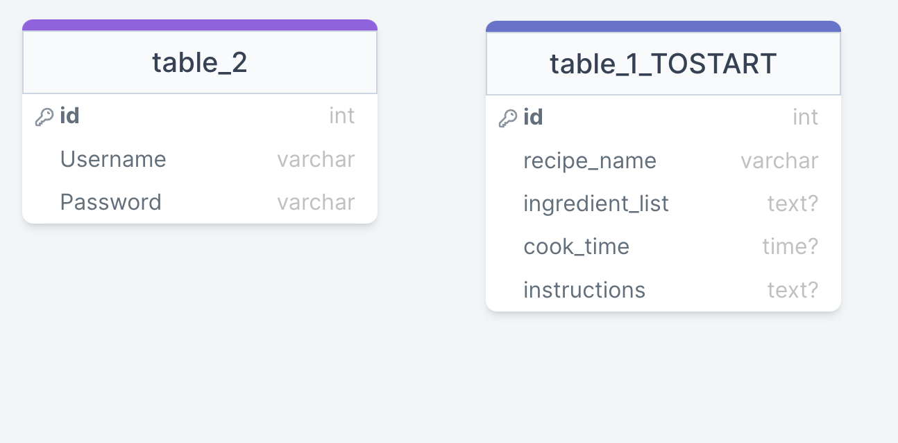

# recime-front

## Elements Shared from Screen to Screen in Recime:
* Recimes Header - thin header stretching across.  Always visible (for now). With hamburger menu on far left. 
* Recimes Background Color always #FAF5E6 across all screens. 
* Recimes background image transitioning from simple cooking utensils, boiling pot, etc. (no more than four I think). 

### Elements for Log in Page:
* One simple box housing two separate elements.
    * Username
    * Password

* Underneath box listing Don't Have an Account? Sign up here -> (This goes to sign in page.)

### Elements on Main Page: 
* "My Recipes" listed at the top.  ADD LATER POSSIBLY button ability to take you back to top.
* Two Across - Recipes with images as overlay. Use generic images to start. Names in white text at bottom of box.

### Elements on Recipe Page:
* Recipe Name at top. Same styling as "My Recipes"
* Time in left side. Image in Right side (image generic to start).
* Ingredient List Box below. 
* Instructions Box Below
#### Future Adds:
    * Ability to have image of done dish.
    * Ability to include image of full recipe. 

### Form for username and login.
* Same background and header.
* Enter username.
* Enter password.
* Keep it simple to start.

### Form for adding a new recipe. 
* Enter Recipe Name.
* Enter Ingredients list.
* Enter Instructions. 
* Enter cook time. 
* Keep it simple to start.

###### Our Color Schemes:

FD1F4A - red/pink
FBBD0D - Gold
000000 - black
images on 25% opacity
FAF5E6 - background

